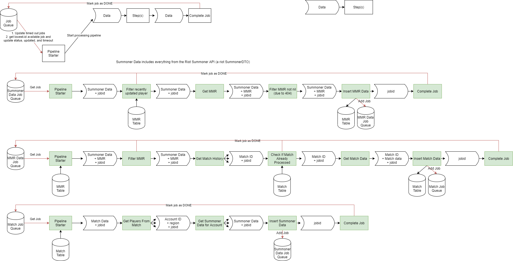

# teemo-tool-data

Teemo Tool Data is a crawler for the Riot API, written in Clojure. Its objective is to record match data from the match histories of sufficiently low-skill League of Legends players. It uses [WhatIsMyMMR](https://na.whatismymmr.com/)'s API to discover a player's skill and keeps the ceiling at roughly sub-Silver. It uses a SQLite database as a job queue and a persistence layer for MMR and match data.

## Architecture Diagram

Each sequence of data->step->data->... is implemented as a [transducer](https://clojure.org/reference/transducers)

## Usage

`lein run` until I package it better.

## Future Changes

- Add option to only run one of the 3 pipelines at a time.
- Add config files/args for database location
- Add config files/args for MMR cap

### Bugs

Most HTTP weirdness is handled but beware.
